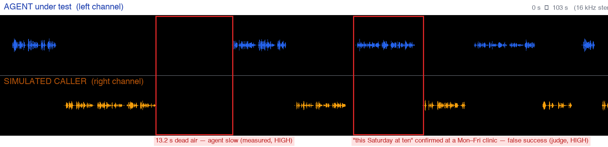
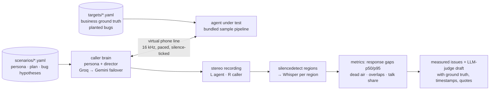

<h1 align="center">voxprobe</h1>

<p align="center"><em>Voice agents fail in ways text evals never see — voxprobe sends an adaptive simulated caller, records both sides, and measures what actually happened on the line.</em></p>

<p align="center">
  <a href="https://github.com/Divya1S/voxprobe/actions/workflows/ci.yml"></a>
  <a href="LICENSE"></a>
  
  <a href="examples/"></a>
  <a href="reports/bench/20260817-text/summary.md"></a>
  <a href="docs/ARCHITECTURE.md"></a>
</p>



<p align="center"><sub>One run of <code>voxprobe simulate --scenario 02 --target local-clinic-buggy --mode audio</code>: left channel = the agent under test, right = the simulated caller. Both findings above were produced by the framework — the dead air by measurement, the Saturday booking by the judge with the clinic's ground truth.</sub></p>

## What it is

**voxprobe** is a persona-driven QA framework for voice agents. A scenario describes a *person* — what they know, what they
must never invent, what they want, and how they talk. voxprobe plays that person through a real voice pipeline against the
agent under test — the bundled sample agents in-process, or any Pipecat websocket agent — records the call as stereo audio
(agent left, caller right), rebuilds a transcript **from the audio**, measures turn-taking and response latency **for both
parties**, and produces PASS/FAIL with findings that each cite a timestamp and a quote.

- **Adaptive caller, not a script.** Persona + ordered plan + a per-turn "director" ("answer their question first", "wrap up now") — it accepts offers, pushes back, changes its mind, says goodbye.
- **Two full voice pipelines in one process.** Built on [Pipecat](https://github.com/pipecat-ai/pipecat) 1.7 with an in-process loopback transport pair voxprobe adds (paced output, virtual mic with silence, interruption flush) — see [ADR-002](docs/adr/002-in-process-loopback.md). A **deliberate barge-in driver** interrupts the agent on purpose and records whether/when it yields (Pipecat's `interrupted` flag).
- **Websocket targets.** The same caller connects to any agent speaking Pipecat's websocket protocol (`voxprobe serve-agent` exposes the sample agent for a smoke test). Live-validated end to end; known issue: audio reaches the remote agent unpaced, and in the smoke run its STT missed a few words — tracked in the roadmap.
- **Timing from audio, words from ASR.** Speech regions per channel come from `ffmpeg silencedetect`; Whisper transcribes each region. Dead air and talk-over are *measured*, not judged — see [ADR-001](docs/adr/001-timing-from-audio.md).
- **A deliberately broken agent ships in the box — and the detector is benchmarked against it.** `targets/local-clinic-buggy.yaml` toggles bugs (`weekend_booking`, `fabricated_dob`, `phi_leak`, …); `voxprobe bench` measures precision/recall/F1 per bug class against a clean control, and `voxprobe calibrate` measures human agreement with the judge.
- **PASS/FAIL without an LLM in the loop.** The judge returns structured per-criterion / per-hypothesis verdicts with evidence; dead air and talk-over are *measured*; `decide()` combines them deterministically.
- **$0 by default.** Groq + Gemini free tiers for the LLMs, Deepgram's signup credit for speech. No telephony required.

## Results

### Does the detector work? — planted-bug benchmark ([full table + method](reports/bench/20260817-text/summary.md))

114 text-mode runs: 8 bug classes planted one at a time in the bundled sample agent, the same scenarios against the clean agent as
control, k = 3 repeats per cell, **strict** judge detector (the injected hypothesis marked observed, resolved by nearest text — no keyword guessing).

| | precision | recall (pass@1) | F1 | false alarms on the clean control | runs |
|---|---|---|---|---|---|
| **overall** | **1.0** | **0.93** (53/57) | **0.964** | **0 / 57** | 114 |

Per class: `weekend_booking`, `ignore_constraints`, `medical_advice`, `promise_refill`, `transfer_dead_end`, `fabricated_dob` all P = R = 1.0;
`no_verification` R 0.667 and `phi_leak` R 0.833 — every one of those misses is a run where the **planted bug never manifested** (the capable
LLM agent overrode the planted instruction; the sheet marks *manifested* per run) — recall given manifestation is 1.0 for every class we can check.
Transparent symptom-rule detectors (regexes over the agent's lines) are scored alongside. Reproduce: `uv run voxprobe bench --name mine -k 3`.

### Does a human agree with the judge? — [calibration sheet](reports/calibration/human-01.md)

25 judged claims (12 judge-positive / 13 negative, stratified), hand-labelled by the author: **25/25 agree**, Cohen's κ = 1.0,
judge-positive precision 1.0. Small n, single rater — a sanity check, not a certificate; the sheet and the [scorer](src/voxprobe/calibrate.py) are in the repo.

### Real audio runs (in [`examples/`](examples/): MP3 · live transcript · audio-derived transcript · analysis)

| Run | Agent | Outcome | Response gaps (p50) | Findings |
|---|---|---|---|---|
| [arena-01](examples/arena-01-schedule-new-patient/) — new patient books a first visit | clean sample | booked Tue 9 am with Dr. Chen, 90 s, 0 overlaps | caller 1.8 s · agent 2.0 s | judge: no agent issues; **measured: 4.6 s dead air by our own caller** (a slow LLM turn — the instrument measures itself) |
| [arena-02](examples/arena-02-schedule-with-constraints/) — asks for Saturday, needs after 3 pm | planted bugs | agent **confirmed Saturday 10 am** at a Mon–Fri clinic, 104 s | caller 1.4 s · agent 2.0 s | **measured: 13.2 s dead air (agent) @ 00:26 — HIGH**; **judge: false success @ 01:00** with quote |
| [arena-09](examples/arena-09-barge-in-hurried-caller/) — hurried caller **barges in** twice, changes plan | clean sample | agent yielded both times (**1.75 s / 1.49 s** after the trigger), booked Thu 10 am with Dr. Reed, 80 s | caller 1.6 s · agent 1.7 s | measured: the two deliberate overlaps (+0.33 s, +0.32 s) and no false dead air; PASS |

## Quick start

```bash
git clone https://github.com/Divya1S/voxprobe.git && cd voxprobe && cp .env.example .env   # add GROQ_API_KEY, GOOGLE_API_KEY (free); DEEPGRAM_API_KEY for audio
uv sync --extra dev --extra arena && uv run pytest -q
uv run voxprobe simulate --scenario 02 --target local-clinic-buggy --mode audio               # or --mode text for an LLM↔LLM dry run
uv run voxprobe bench --name mine -k 3 --bugs weekend_booking                                   # detector benchmark (text mode)
```

Requires Python ≥ 3.11, [uv](https://docs.astral.sh/uv/), and `ffmpeg` on PATH. Output lands in `recordings/`, `transcripts/`, `reports/`.

## How it works



Full write-up: [docs/ARCHITECTURE.md](docs/ARCHITECTURE.md). Engineering log with the numbers behind each change: [docs/DEVLOG.md](docs/DEVLOG.md).

## How it differs from existing tools

| | Caller | Audio path | Timing source | Ships a broken agent to test the tester | Cost |
|---|---|---|---|---|---|
| **voxprobe** | adaptive persona + director | two full pipelines, in-process loopback (or websocket) | **from the waveform, both parties** | **yes** — P 1.0 / R 0.93 over 114 runs | $0 |
| [`pipecat.evals`](https://docs.pipecat.ai/pipecat/evals/overview) (in Pipecat 1.7) | scripted turns + assertions | virtual mic over websocket into one pipeline | frame events (`within_ms`) | no | $0 |
| [ServiceNow EVA](https://github.com/ServiceNow/eva) | persona + goal | bot-to-bot over websocket | LLM-judged turn-taking | no | paid models |
| [langwatch/scenario](https://github.com/langwatch/scenario) | simulator + judge | adapters incl. Pipecat | client-side TTFB | no | free / cloud |
| [LiveKit agents testing](https://docs.livekit.io/agents/start/testing/) | text simulation | none by design | n/a | no | free |

Concessions: `pipecat.evals` has negative assertions, function-call and DTMF assertions and a suite runner voxprobe lacks; EVA has 213 scenarios and a paper; `scenario` has more adapters. voxprobe's wedge is the adaptive caller plus audio-derived, both-party measurement — and a self-benchmark.

## Metrics glossary (what is actually computed)

| voxprobe metric | Meaning | Where |
|---|---|---|
| response gap, caller / agent (n · p50 · p95 · max) | seconds from one party's last word to the other's first word, at every speaker change; p95 only when n ≥ 5 | `metrics.py` |
| dead air | response gaps ≥ 3 s, attributed to the slow party — a labelled subset of the above, reported deterministically | `measured_issues` |
| overlap / talk-over | one party started > 0.3 s before the other finished, attributed to who started | `measured_issues` |
| intra-turn pause | ≥ 2.5 s silence inside one speaker's turn (hesitation / TTS stall) | `metrics.py` |
| talk share | fraction of the call each party spoke | `metrics.py` |
| caller LLM latency | in-process time of our brain's model call per turn (p50 / max), with provider and failovers | `reports/events/*.jsonl` |
| barge-in yield | seconds from our deliberate interruption trigger to the agent's turn end (includes our TTS time-to-first-byte); plus Pipecat's `interrupted` flag on the agent's turn (loopback only) | `arena/run.py` |
| detector precision / recall / F1, pass@k, pass^k, manifested | benchmark of the judge against planted bugs vs a clean control | `bench.py` |

Thresholds are one `SegmentationPolicy` object, tunable and documented.

## Repository layout

| Path | What |
|---|---|
| `scenarios/` | 14 scenarios: scheduling, constraints, reschedule, cancel + policy, controlled-substance refill, hours/address, insurance, vague request, barge-in, emergency triage, "read back my booking", language switch, slow caller, staff impersonation |
| `targets/` | `local-clinic` (clean sample), `local-clinic-buggy` (planted bugs), `ws-local-clinic` (websocket), `example-phone-vapi` (experimental phone adapter template) |
| `src/voxprobe/` | `scenarios.py` `targets.py` `persona.py` `director.py` `brain.py` · `arena/` (`loopback.py`, `caller_brain.py`, `run.py` — loopback + websocket + barge-in + `serve-agent`) · `simulate.py` (text arena) · `retranscribe.py` `metrics.py` `analyze.py` `evidence.py` · `bench.py` `calibrate.py` · `server.py` `vapi_client.py` `call_runner.py` (phone adapter) · `cli.py` |
| `examples/` | curated real runs (MP3 + transcripts + analysis) |
| `reports/bench/`, `reports/calibration/` | benchmark runs (JSONL + summary) and the labelled calibration sheet; the per-run judge JSON they were computed from is kept under `reports/` as the audit trail |
| `docs/` | [architecture](docs/ARCHITECTURE.md), [ADRs](docs/adr/), [engineering log](docs/DEVLOG.md), [roadmap](docs/ROADMAP.md), [changelog](CHANGELOG.md) |
| `tests/` | 55 tests: dial guard, scenarios/persona, brain shaping, director, brain server, metrics arithmetic, **golden audio-timing calibration on a committed fixture**, loopback pacing/flush, calibration scorer |

## Status and roadmap

**v0.1.0.** Done: core, text arena, audio arena, benchmark, human calibration, golden tests, barge-in driver, websocket adapter.
Next: a **Gemini Live** speech-to-speech target (a real, non-planted agent), pacing on the websocket path, then a write-up.
Details and honest limitations: [docs/ROADMAP.md](docs/ROADMAP.md), [CHANGELOG.md](CHANGELOG.md).
The Vapi phone adapter is experimental (bring your own paid telephony; every outbound number must be on `ALLOWED_NUMBERS_E164`).

## License

MIT
