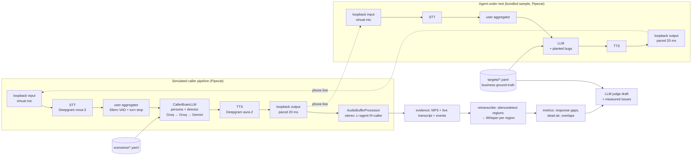
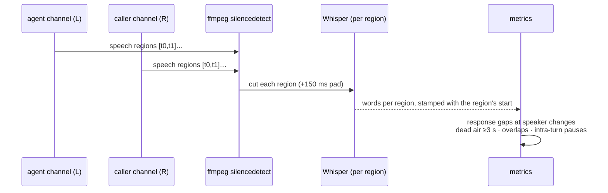

# Architecture

voxprobe answers one question about a voice agent: **what actually happened on the call, and was it right?**
Everything in the design follows from treating the *recording* — not any transcript or log — as the source of truth.

## The two pipelines and the virtual phone line



**Why two full pipelines?** A scripted test can only assert what it scripted. A voice agent's real failures show up when the
caller adapts — accepts an offer, pushes back, changes their mind, says goodbye. So the caller is a complete voice pipeline
with its own STT/VAD/turn-taking and an LLM "brain" that plays a persona (facts it may share, facts it must never invent, an
ordered plan, a per-turn director note). The agent under test is a second complete pipeline. They talk; we listen.

**Why an in-process loopback pair?** Pipecat 1.7 has websocket, PyAudio and WebRTC transports, and its eval harness
(`pipecat.evals`) plays *scripted* utterances through a virtual microphone over a websocket into *one* pipeline. Two full
pipelines in one process, no socket, both parties recorded — that did not exist, so [`arena/loopback.py`](../src/voxprobe/arena/loopback.py)
provides it. The contract that makes it behave like a phone:

| Property | Implementation | Why it matters |
|---|---|---|
| **Paced output** | `LoopbackOutputTransport.write_audio_frame` sleeps one chunk-duration per 20 ms chunk (`_next_send_time` bookkeeping, like a sound card) | Barge-in is only real if audio not yet "played" can still be dropped; without pacing a whole TTS reply is delivered in milliseconds |
| **Continuous input** | `VirtualMicrophone` ticks every 20 ms and pushes the peer's speech when there is some, generated silence otherwise | VAD ends a turn on *silence*; a transport that goes quiet between utterances never yields end-of-turn |
| **Interruption flush** | On `InterruptionFrame` the output resets its clock and flushes the peer's unplayed audio (`mic.flush()`, bytes reported) | Mirrors a device buffer being cleared; the dropped-bytes count is the "how much of the sentence went unheard" metric |
| **Ready handshake** | Both sides call `set_transport_ready()` in `start()` (the base classes don't) | Otherwise the input never creates its queue and the output silently drops everything |

Sample rate is 16 kHz mono PCM16 on the wire; stereo only exists in the recording.

## Timing from audio, words from ASR



Live transcripts (STT events, LLM output) are logs of *intent*: an interrupted sentence was generated but only half was spoken;
first-pass STT misses names and numbers; timestamps are processing times. So findings are only filed against the audio-derived
transcript, and **timing never comes from Whisper** — Whisper drifts across long silences (see DEVLOG: the first version dropped
two lines and mis-stamped the rest). Regions come from each channel's energy; Whisper only supplies words for each region.

Response latency is measured for **both** parties from the same waveform: *agent stops → caller starts* is our own simulator's
speed (a reviewer hears this as natural or laggy — the harness measures itself), *caller stops → agent starts* is the agent under
test. Thresholds are a named `SegmentationPolicy` (merge 1.5 s, overlap 0.3 s, dead air 3 s, intra-pause 2.5 s), not magic numbers.

## What is deterministic and what is judged

| Finding type | Produced by | Example |
|---|---|---|
| Dead air, talk-over | the instrument (`metrics.py` → `measured_issues`) — exact timestamps, rule-based severity, no LLM | *13.2 s dead air before the agent responded @ 00:26 — HIGH* |
| Content / policy failures | LLM judge draft, given the target's **business ground truth** and the scenario's success criteria and bug hypotheses; must quote and timestamp; attributes to `agent` / `simulator` / `uncertain` | *confirmed "this Saturday at ten" at a Mon–Fri clinic — false success* |
| Simulator quality | same judge, separate section (`simulator_notes`) + our own dead-air attribution | *caller took 4.6 s to respond (slow LLM turn)* |

The judge is a *draft*: every content finding is verified against the MP3 at the quoted timestamp before it counts. Ground truth
lives in the target file (hours, providers, address, policies, insurance) so "Saturday" is a fact violation, not a preference.

## Evidence bundle (per run)

```
recordings/<stem>.mp3                stereo, LEFT = agent under test, RIGHT = simulated caller
transcripts/<stem>.md / .json        live transcript from the pipelines (what each side heard/said, with wall-clock offsets)
transcripts/<stem>.whisper.md/.json  audio-derived transcript: per-channel speech regions → Whisper; the authoritative one
reports/events/<stem>.jsonl          caller brain turns: provider, latency ms, prompt tokens, failovers
reports/<stem>.meta.json             scenario, target, duration, ended reason, both-side latencies, file index
reports/<stem>.analysis.{md,json}    metrics table, measured issues, judge draft
```

## Where the phone adapter fits

The same brain, scenarios and evidence pipeline can drive a real phone call through the experimental Vapi adapter
(`server.py` exposes the brain as an OpenAI-compatible endpoint behind a cloudflared tunnel; `vapi_client.py` places the
call from a transient assistant; every outbound number must pass the `ALLOWED_NUMBERS_E164` allow-list). It is isolated
behind a target kind and not required for anything above.

## Decisions (ADRs)

- [ADR-001 — Timing from audio energy, words from Whisper](adr/001-timing-from-audio.md)
- [ADR-002 — In-process loopback pair instead of a websocket harness](adr/002-in-process-loopback.md)
